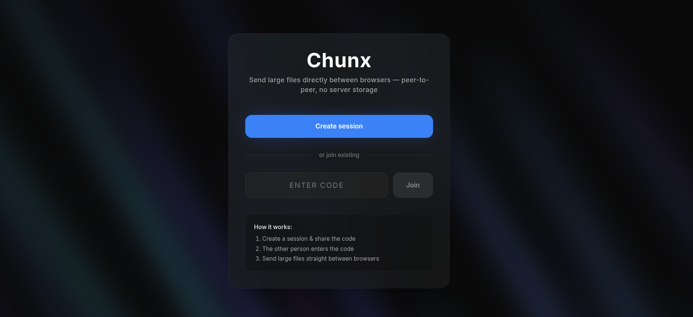
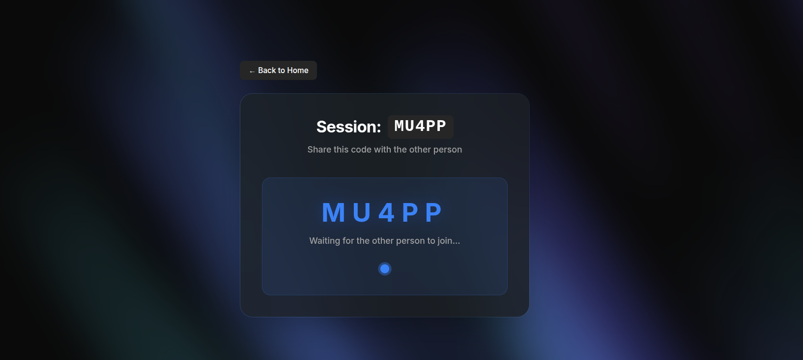

# Chunx

A simple peer-to-peer file sharing app for sending large files directly between two browsers.

## What It Does

Chunx lets two users share files of any size — even multiple gigabytes — without uploading them to a server. The file goes **directly** from one computer to the other using WebRTC. The server only helps the two users find each other; it never sees the file.




## How It Works

1. **Create a session** — One user opens the site, clicks "Create Session", and gets a short code (like `AB12C`).
2. **Share the code** — The sender gives the code to a friend through any chat or messaging app.
3. **Join the session** — The friend opens the same site, enters the code, and clicks "Join Session".
4. **Pick a file** — The sender selects or drags a file onto the page.
5. **Direct transfer** — The file is split into small chunks and sent peer-to-peer. The receiver writes each chunk straight to disk, so memory stays low even for very large files.

## Tech Stack

| Layer | Technology |
|---|---|
| Frontend UI | Next.js (Pages Router) + TypeScript + TailwindCSS |
| Signaling Server | Node.js + `ws` (WebSockets) |
| Peer-to-Peer | WebRTC (`RTCPeerConnection` + `DataChannel`) |
| File reading (sender) | Browser File API (`file.slice()`) |
| File writing (receiver) | StreamSaver.js (writes chunks to disk via service worker) |
| Network traversal | Google STUN server (no TURN) |

## Folder Structure

```
chunx/
├── client/                       # Next.js frontend
│   ├── lib/
│   │   ├── signalingClient.ts    # WebSocket wrapper for signaling
│   │   ├── peerConnection.ts     # WebRTC peer connection wrapper
│   │   ├── fileSender.ts         # Reads file in chunks, sends with backpressure control
│   │   └── fileReceiver.ts       # Receives chunks, writes to disk via StreamSaver
│   ├── components/
│   │   ├── DropZone.tsx          # Drag-and-drop / click-to-browse file picker
│   │   ├── ProgressBar.tsx       # Progress bar display
│   │   └── Modal.tsx             # Warning modal for multiple file drops
│   ├── pages/
│   │   ├── _app.tsx              # App wrapper, sets up StreamSaver
│   │   ├── index.tsx             # Home page (create / join session)
│   │   └── session/[code].tsx    # Session page (WebRTC + file transfer)
│   └── public/
│       └── mitm.html             # StreamSaver service worker bridge
│
└── signaling-server/             # Node.js signaling server (port 8081)
    └── src/
        ├── index.ts              # HTTP + WebSocket server with heartbeat
        ├── types.ts              # Message types + send() helper
        ├── sessionManager.ts     # Session creation, code generation, peer lookup
        └── relay.ts              # Routes signaling messages between peers
```

## Quick Start

**Signaling Server**
```bash
cd signaling-server
pnpm dev          # development
pnpm build && pnpm start   # production
```

**Frontend**
```bash
cd client
pnpm dev          # development
pnpm build && pnpm start   # production
```
