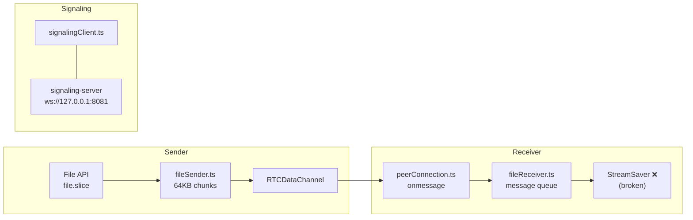

# Chunx Codebase Analysis — StreamSaver → `showSaveFilePicker`

## Codebase Overview

Chunx is a P2P file sharing app. Two peers connect via WebRTC DataChannel (brokered by a signaling server on port 8081), then transfer files directly — the server never sees file data.

### Architecture Map



### Key Files

| File | Role |
|------|------|
| [fileSender.ts](file:///home/ppriyankuu/Projects/chunx/client/lib/fileSender.ts) | Reads file in 64KB chunks, sends over DataChannel with backpressure |
| [fileReceiver.ts](file:///home/ppriyankuu/Projects/chunx/client/lib/fileReceiver.ts) | Sequential message queue, currently writes via StreamSaver (broken) |
| [peerConnection.ts](file:///home/ppriyankuu/Projects/chunx/client/lib/peerConnection.ts) | RTCPeerConnection + DataChannel wrapper |
| [signalingClient.ts](file:///home/ppriyankuu/Projects/chunx/client/lib/signalingClient.ts) | Typed WebSocket wrapper for signaling |
| [types.ts](file:///home/ppriyankuu/Projects/chunx/client/lib/types.ts) | Shared types (messages, progress, transfer state) |
| [session/[code].tsx](file:///home/ppriyankuu/Projects/chunx/client/pages/session/%5Bcode%5D.tsx) | Session page — routes DataChannel messages to FileReceiver |
| [_app.tsx](file:///home/ppriyankuu/Projects/chunx/client/pages/_app.tsx) | Sets `streamSaver.mitm` (can be removed) |

---

## The StreamSaver Problem

StreamSaver works by intercepting `fetch()` requests via a service worker. It:
1. Creates an artificial download URL
2. Registers a service worker that intercepts the fetch to that URL
3. Pipes a `ReadableStream` through the service worker to a synthetic `Response`
4. The browser treats this as a file download

**Why it's broken here:** StreamSaver's `writer.write()` returns a Promise that blocks when the service worker's internal buffer is full. Since `fileReceiver.ts` uses a sequential message queue, one blocked `write()` hangs the entire queue forever. Chunks 3+ and `FILE_END` never get processed. The result is a 15-byte file (just the service worker's HTTP response header placeholder).

The fire-and-forget workaround (not awaiting `writer.write()`) was tried too — but then chunks get lost because StreamSaver's service worker pipe hasn't fully established yet.

**Bottom line:** StreamSaver is a fragile abstraction that adds complexity (service workers, mitm.html, timing-sensitive pipe setup) without reliability guarantees in a Next.js dev/prod environment.

---

## Proposed Replacement: `showSaveFilePicker` + Blob Fallback

### Strategy

```
if (window.showSaveFilePicker exists)  →  File System Access API  (Chrome/Edge)
else                                    →  Blob + <a download>    (Firefox/Safari)
```

### How Each Path Works

#### Path 1: `showSaveFilePicker` (Chromium browsers)

```typescript
// 1. User picks save location BEFORE transfer starts
const handle = await window.showSaveFilePicker({
  suggestedName: fileName,
  types: [{ accept: { [mimeType]: [] } }],
});
const writable = await handle.createWritable();

// 2. Each chunk is written directly to disk — no memory accumulation
await writable.write(chunk);  // native backpressure, no service worker

// 3. When done
await writable.close();
```

**Key advantage:** `writable.write()` has real backpressure — it returns a Promise that resolves when the OS has flushed the data. No service worker, no mitm.html, no artificial fetch interception. It's a direct pipe from WebRTC → disk.

#### Path 2: Blob fallback (Firefox/Safari)

```typescript
// 1. Accumulate chunks in memory
const chunks: Uint8Array[] = [];
chunks.push(chunk);

// 2. When transfer is complete, create a download link
const blob = new Blob(chunks, { type: mimeType });
const url = URL.createObjectURL(blob);
const a = document.createElement('a');
a.href = url;
a.download = fileName;
a.click();
URL.revokeObjectURL(url);
```

**Tradeoff:** The entire file lives in memory before download. Fine for files under ~500MB-1GB. Not ideal for huge files, but it's the only reliable cross-browser option without service workers.

---

## What Changes in the Codebase

### Files to Modify

| File | Change |
|------|--------|
| [fileReceiver.ts](file:///home/ppriyankuu/Projects/chunx/client/lib/fileReceiver.ts) | **Complete rewrite of write strategy.** Replace StreamSaver with `showSaveFilePicker` + blob fallback. Remove `getStreamSaver()`. |
| [_app.tsx](file:///home/ppriyankuu/Projects/chunx/client/pages/_app.tsx) | **Remove StreamSaver import.** No more dynamic import or mitm setup. |
| [session/[code].tsx](file:///home/ppriyankuu/Projects/chunx/client/pages/session/%5Bcode%5D.tsx) | **Minor change.** May need to call a `prepareReceive()` method to trigger the file picker before chunks arrive. |

### Files to Delete

| File | Reason |
|------|--------|
| `client/public/mitm.html` | StreamSaver's service worker bridge — no longer needed |

### Dependencies to Remove

| Package | Reason |
|---------|--------|
| `streamsaver` | Replaced entirely |
| `@types/streamsaver` | No longer needed |

---

## Key Design Decision: When to Show the File Picker

> [!IMPORTANT]
> `showSaveFilePicker()` requires a **user gesture** (click/tap). You can't call it from a WebRTC `onmessage` handler — the browser will throw a `SecurityError`.

There are two approaches:

### Option A: Prompt on `FILE_START` (requires user interaction)
When `FILE_START` arrives, show a UI prompt ("Incoming file: report.pdf — Accept?"). User clicks "Accept", which triggers `showSaveFilePicker()` inside the click handler. Chunks are buffered in memory until the picker resolves, then flushed.

### Option B: Pick save location eagerly
Add a "Ready to receive" button that the user clicks before any transfer. This pre-authorizes the file picker. When `FILE_START` arrives, we already have the writable handle.

**Option A is more natural** — you don't know the filename until `FILE_START` arrives, and asking users to pre-authorize is awkward. The tradeoff is a small memory buffer of chunks that arrive between `FILE_START` and the user clicking "Accept".

---

## Open Questions

1. **Which approach for the file picker prompt?** Option A (prompt on FILE_START) or Option B (pre-authorize)?
2. **Memory limit for blob fallback?** Should we warn/block transfers over a certain size on Firefox/Safari?
3. **Should we keep the `streamsaver` dependency as a fallback**, or go full clean break?
